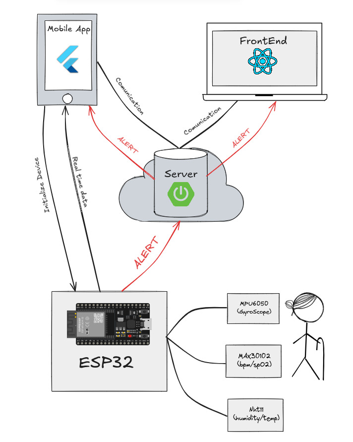

# BeatsGuard

## Overview

BeatsGuard is an integrated system designed to monitor and manage user health data through IoT devices and digital platforms. It consists of the following components:

1. **Backend**: A Spring Boot application that manages user data and measurements.
2. **Frontend**: A React-based web interface where users can log in and view their measurement history.
3. **Mobile App**: A Flutter-based mobile application that connects to the BeatsGuard device to capture measurements.
4. **QA Healthcare**: A Python-based medical chatbot that leverages machine learning to answer thousands of medical questions interactively.

---

## Repositories

### 1. [BeatsGuard Backend](https://github.com/hellodikki/beatsguard-backend)
The backend is a Spring Boot application responsible for:
- Managing user accounts and their associated measurements.
- Exposing RESTful APIs for data retrieval and submission.
- Triggering alerts based on abnormal health metrics.

### 2. [BeatsGuard Frontend](https://github.com/hellodikki/beatsguard-frontend)
The frontend is a React web application that allows users to:
- Log in to their accounts.
- View and analyze their historical measurement data.
- Monitor real-time alerts.

### 3. [BeatsGuard Mobile](https://github.com/AhmedFatrah2001/beatsguard-mobile)
The mobile app is built with Flutter and provides:
- A connection interface to the BeatsGuard IoT device for capturing measurements.
- Real-time data visualization from sensors (e.g., heart rate, SpO2, and temperature).
- Notifications for health alerts.

### 4. [QA Healthcare](https://github.com/AhmedFatrah2001/qa_healthcare)
QA Healthcare is a Python-based chatbot that:
- Uses machine learning models to provide accurate and interactive responses to medical queries.
- Offers support for thousands of healthcare-related questions.
- Can be integrated with other BeatsGuard components for enhanced functionality.

---

## Key Features

### IoT Integration
- Seamless connection between the BeatsGuard mobile app and IoT sensors (e.g., MAX30102, MPU6050, DHT11).

### User Management
- Secure user authentication and data storage managed by the backend.

### Real-Time Monitoring
- Real-time health data capture and alerting for abnormal metrics.

### Interactive Medical Assistance
- A chatbot capable of addressing diverse healthcare concerns.

---

## Architecture
The system integrates multiple components, working together as shown in the diagram above:
1. **IoT Sensors** -> Mobile App (Flutter) -> Backend (Spring Boot) -> Frontend (React).
2. QA Healthcare chatbot operates as a standalone Python service for answering medical queries.

---

Feel free to explore each repository for more details and contributions!
